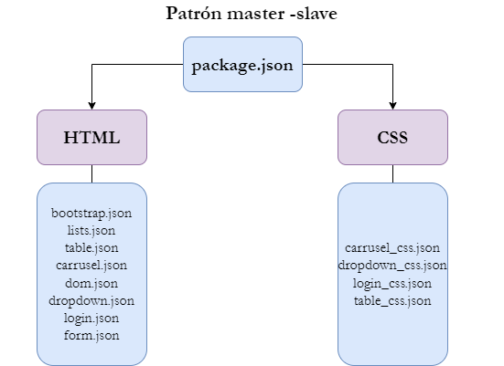

# Título del proyecto: Plugin VS Code

## Índice
1. [Características](#características) 📋
2. [Contenido del proyecto](#contenido-del-proyecto) 📁
3. [Tecnologías](#tecnologías) 💻
4. [IDE](#ide) 📟
5. [Instalación](#instalación) 📥
7. [Autores](#autores) 🧍
8. [Institución Académica](#institución-académica) 🏫

#### Características:

  - Proyecto de plugin para VS Code para la creación de bloques de código Html y css usados frecuentemente en la programación de software

  #### Contenido del proyecto
  | Ruta del archivo   | |
|:----------:|
|[package.json](https://github.com/JheynerLobo21/Plugin-VSCode/blob/main/package.json) 
|[launch.json](https://github.com/JheynerLobo21/Plugin-VSCode/blob/main/.vscode/launch.json)
|[bootstrap.json](https://github.com/JheynerLobo21/Plugin-VSCode/blob/main/snippets/html/bootstrap.json) 
|[carrusel.json](https://github.com/JheynerLobo21/Plugin-VSCode/blob/main/snippets/html/carrusel.json)
|[dom.json](https://github.com/JheynerLobo21/Plugin-VSCode/blob/main/snippets/html/dom.json)
|[dropdown.json](https://github.com/JheynerLobo21/Plugin-VSCode/blob/main/snippets/html/dropdown.json)
|[form.json](https://github.com/JheynerLobo21/Plugin-VSCode/blob/main/snippets/html/form.json)
|[lists.json](https://github.com/JheynerLobo21/Plugin-VSCode/blob/main/snippets/html/lists.json)
|[login.json](https://github.com/JheynerLobo21/Plugin-VSCode/blob/main/snippets/html/login.json)
|[table.json](https://github.com/JheynerLobo21/Plugin-VSCode/blob/main/snippets/html/bootstrap.json)
|[carrusel_css.json](https://github.com/JheynerLobo21/Plugin-VSCode/blob/main/snippets/css/carrusel_css.json)
|[dropdown_css.json](https://github.com/JheynerLobo21/Plugin-VSCode/blob/main/snippets/css/dropdown_css.json)
|[login_css.json](https://github.com/JheynerLobo21/Plugin-VSCode/blob/main/snippets/css/login_css.json)
|[table_css.json](https://github.com/JheynerLobo21/Plugin-VSCode/blob/main/snippets/css/table_css.json)
|:----------:|

#### Tecnologías

  -  

HTML5 no es una nueva versión del antiguo lenguaje de etiquetas, ni siquiera una mejora de esta ya antigua tecnología, sino un concepto nuevo para la construcción del sitio web y aplicaciones en una era que combina dispositivos móviles, computación en la nube.
HTML5 provee básicamente tres características: Estructura, estilo y funcionalidad. HTML5 es considerado el producto de la combinación de HTML, CSS y JavaScript. Estas tecnologías son altamente dependientes y actúan como una sola unidad organizada bajo la especificación de HTML5. [(Gauchat, 2012)](#gauchat-g-2012-el-gran-libro-de-html5-css3-y-javascript-20128).

A continuación se puede encontrar un tutorial de Html [Iniciar](https://www.w3schools.com/html/)

  - 

Javascript es un lenguaje interpretado usado para múltiples propósitos pero solo considerado como un complemento hasta ahora. Una de las innovaciones que ayudó a cambiar el modo en que vemos Javascript fue el desarrollo de nuevos motores de interpretación, creados para acelerar el procesamiento de código. La clave de los motores más exitosos fue transformar el código Javascript en código máquina para lograr velocidades de ejecución similares a aquellas encontradas en aplicaciones de escritorio.
Esta mejorada capacidad permitió superar viejas limitaciones de rendimiento y confirmar el lenguaje Javascript como la mejor opción para la web. 

Existen tres técnicas para incorporar código Javascript dentro de HTML. Sin embargo, al igual que en CSS, solo la inclusión de
archivos externos es la recomendada a usar en HTML5. [(Gauchat, 2012)](#gauchat-g-2012-el-gran-libro-de-html5-css3-y-javascript-20128).   

A continuación se puede encontrar un tutorial de JavaScript [Iniciar](https://www.w3schools.com/js/)

  - 

CSS es un lenguaje que trabaja junto con HTML para proveer estilos visuales a los elementos del documento, como tamaño, color, fondo, bordes, etc…
IMPORTANTE: En este momento las nuevas incorporaciones de CSS3 están siendo implementadas en las últimas versiones de los navegadores más populares, pero algunas de ellas se encuentran aún en estado experimental. 

Oficialmente CSS nada tiene que ver con HTML5. CSS no es parte de la especificación y nunca lo fue. Este lenguaje es, de hecho, un complemento desarrollado para superar las limitaciones y reducir la complejidad de HTML. En consecuencia, CSS pronto fue
adoptado como la forma de separar la estructura de la presentación. Desde entonces, CSS ha crecido y ganado importancia, pero siempre desarrollado en paralelo, enfocado en las necesidades de los diseñadores y apartado del proceso de evolución de HTML. [(Gauchat, 2012)](#gauchat-g-2012-el-gran-libro-de-html5-css3-y-javascript-20128)

A continuación se puede encontrar un tutorial de CSS [Iniciar](https://www.w3schools.com/css/)

A continuación puede visualizar un video explicativo de cada una de las tecnologías anteriormente nombradas.

Usted puede ver el siguiente marco conceptual sobre HTML5:
  - [Vídeo explicativo de HTML5](https://www.youtube.com/watch?v=M4wmJVvlzeY)

Usted puede ver el siguiente marco conceptual sobre Bootstrap:
  - [Vídeo explicativo de Bootstrap](https://www.youtube.com/watch?v=59pex8k8Xr8)

Usted puede ver el siguiente marco conceptual sobre CSS:
  - [Vídeo explicativo de CSS](https://www.youtube.com/watch?v=VMkA4CMloS0)

Usted puede ver el siguiente marco conceptual sobre JavaScript:
  - [Vídeo explicativo de JavaScript](https://www.youtube.com/watch?v=Nrp3c6kNyAw)

#### IDE

- El proyecto se desarrolla usando Visual Studio Code 

### Instalación

El plugin se encuentra en MarketPlacce de Visual Studio Code con el nombre de "Arqui-jlm"

Si desea ejecutar clonar el repositorio y correrlo en VS Code siga las siguientes instruccuiones:

## Get up and running straight away

* Press `F5` to open a new window with your extension loaded.
* Create a new file with a file name suffix matching your language.
* Verify that your snippets are proposed on IntelliSense.

### Autores
Proyecto desarrollado por: 

Jheyner Lobo (<jheyneralexanderld@ufps.edu.co>).

Leider Martinez (<leideryesidmm@ufps.edu.co>).

Matilde Arévalo (<matildealexandraal@ufps.edu.co>)
                          

### Institución Académica   
Proyecto desarrollado en la Materia programación web del  [Programa de Ingeniería de Sistemas] de la [Universidad Francisco de Paula Santander]

   [Programa de Ingeniería de Sistemas]:<https://ingsistemas.cloud.ufps.edu.co/>
   [Universidad Francisco de Paula Santander]:<https://ww2.ufps.edu.co/>

